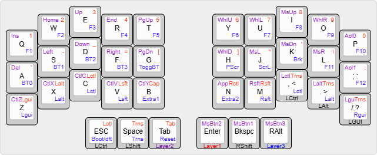
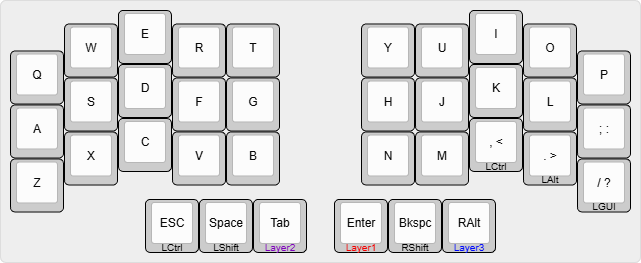
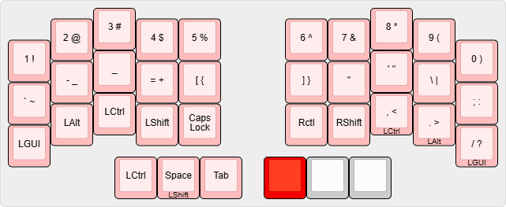
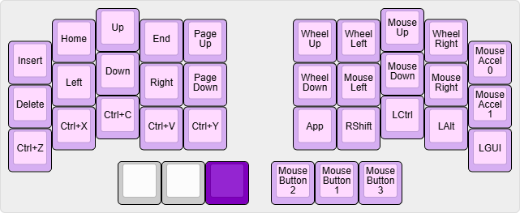
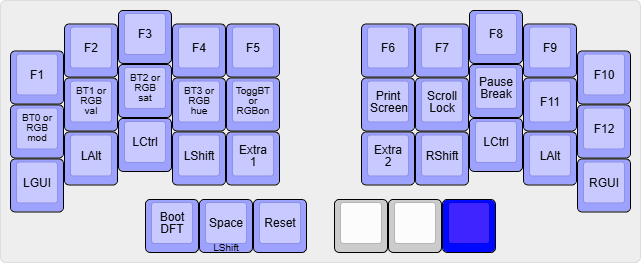

# shiftwaltz

**shiftwaltz** is a 36-key keymap for ethnic typers and designers, who cannot use home-row mods because of inevitable issues.

This may have:

- Tenkeyless-styled number rows and function rows

- Right Alt on default layer for some local usages (you can change this to Delete key or so on)

- Left Ctrl hold key on default layer for shortcuts of design tool

## Default Layer

This provides normal qwerty, but without home rows. Other modifiers goes to right keys(',' , '.' , '/').

## Layer 1-Numbers and Symbols

To write symbols, I intended using thumb shift for it. It is also feels good that replacing Tab key to Left Shift.

## Layer 2-Navigators

These may resembles to traditional arrow key positions, rather than VIM navigators. Targeting to one hand usage for design editing, I added Ctrl+Y(redo) shortcuts and positioned arrow key to left hand.

## Layer 3-Functions

Also with some qmk & zmk provided keys for programmable keyboards. I positioned bluetooth keys for example, but you may use RGB or other keys.
